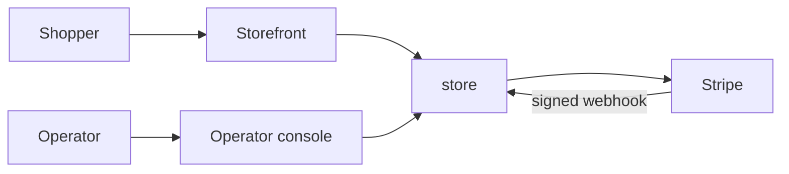
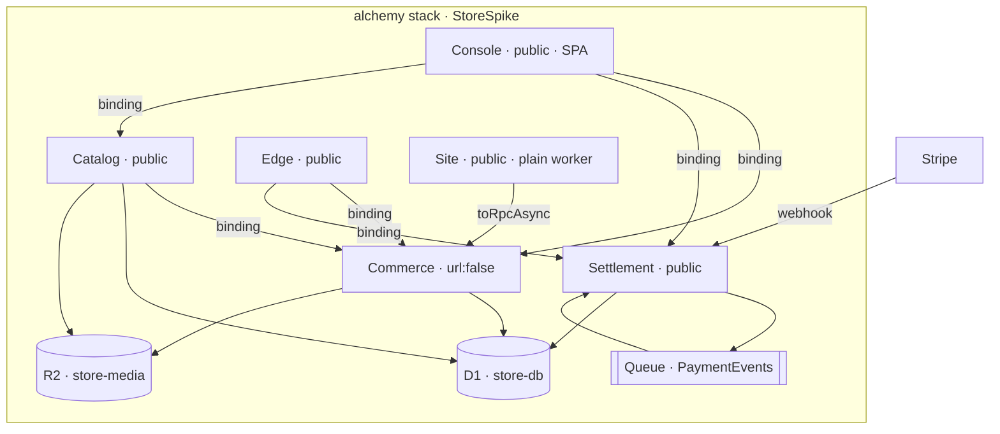
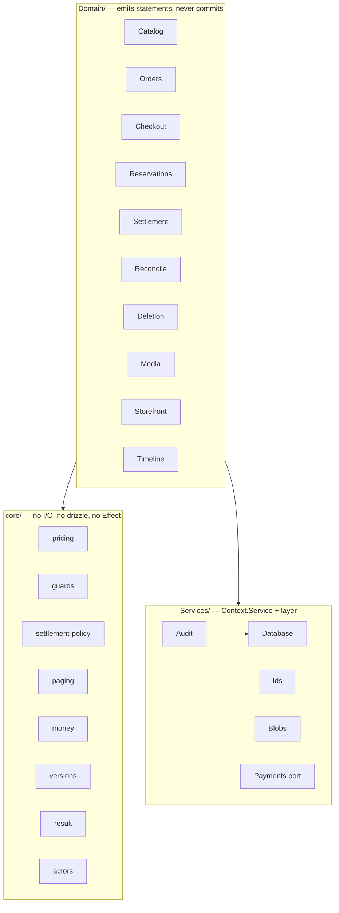

# store

Commerce substrate for the somewhatintelligent platform. One alchemy stack, six
Cloudflare Workers, D1, R2, a queue and a cron.

Built to be lifted into `platform/` intact. Pinned to its versions — effect
`4.0.0-beta.101`, drizzle-orm `1.0.0-rc.4`, alchemy `2.0.0-beta.65`.

There is no authentication in this repo. The platform supplies it at two layers
that do not exist here. Read [CLAUDE.md](./CLAUDE.md) before filing a security
issue — it lists what is deliberate and what is still a defect.

---

## What it implements

| Capability | Detail |
|---|---|
| Product lifecycle | draft → release → active release. Draft is operator state; a release is immutable while retained. |
| Variants | size and SKU per product, stock or pre-order mode, expected ship date |
| Pre-order runs | per-product cap; claims guarded against oversubscription |
| Media | R2-backed, streamed through a Worker, ordered, roles `cover` / `gallery` / `evidence` |
| Storefront reads | list and detail, sourced only from the active release |
| Checkout | cart pricing, stock reservation, payment session creation |
| Settlement | provider webhook → queue → order state, with replay and refunds |
| Reconcile | cron sweep that heals lost webhooks and releases abandoned stock |
| Order lifecycle | `pending → paid → shipped → delivered`, `cancelled` as a terminal exit |
| Fulfilment | carrier and tracking, delivery marking |
| Deletion | two-phase plan/confirm with an impact report and drift detection |
| Audit | every mutation and its ledger row commit in one D1 batch |
| Idempotency | command ledger keyed per actor, action and command id |

## Surfaces

| Worker | Address | Surface |
|---|---|---|
| **Commerce** | none (`url: false`) | 30 methods over service binding — the whole domain |
| **Catalog** | public | `GET /products`, `/products/:slug`, `/media/:id`; `StorefrontRpcs` at `/rpc` |
| **Edge** | public | `OperatorRpcs` — 27 procedures, Schema-decoded |
| **Settlement** | public | `POST /webhook`; queue consumer; cron `*/15 * * * *`; `settleNow` `sweepNow` `provider` |
| **Console** | public | TanStack SPA and a closed `/api/*` table; binds Commerce, Settlement, Catalog |
| **Site** | public | plain `export default { fetch }`; binds Commerce via `toRpcAsync` |

### Commerce methods

```
catalog     listProducts getProduct createProduct saveProductDraft publishProduct
            setProductStatus putVariant setPreorderCap adjustStock
            ingestProductMedia reorderProductMedia
orders      listOrders getOrder orderTimeline setOrderStatus fulfillOrder markDelivered
deletion    planProductReleaseDeletion deleteProductRelease planProductDeletion
            deleteProduct planVariantDeletion deleteVariant
            planProductMediaDeletion deleteProductMedia
storefront  placeOrder getCustomerOrder listStorefront getStorefrontProduct
config      paymentsProvider
```

`OperatorRpcs` mirrors the catalog, orders and deletion groups and adds
`runSweep` and `replayEvent`. `StorefrontRpcs` is `placeOrder` and `getMyOrder`.

## Architecture

### C1 — Context



### C2 — Container



### C3 — Component



`core/` is the split the platform's `app-core` boundary requires: that zone
declares `allow: []` and forbids `fetch`, `caches.*`, `crypto.subtle.*` and
`cloudflare:workers.*`.

## Data model

`product` `product_draft` `product_release` `product_image`
`product_release_image` `product_variant` `customer_order` `order_item`
`payment_event` `command_event` `store_operator_deletion_intent`

D1 has no transactions. `batch` is the only atomicity primitive; writes use
guarded conditional UPDATEs and read `meta.changes`.

## Layout

```
alchemy.run.ts              the stack
site/worker.ts              plain worker — no Effect runtime
console/                    TanStack SPA served by Console
src/
  core/                     pure decisions
  Domain/                   statements and typed failures
  Services/                 capabilities
  Workers/                  the six workers
  Infrastructure/           Stripe dev listener
test/
  unit/                     157 tests, no infrastructure
  *.integ.test.ts           30 tests against a live deployment
migrations/                 generated from Domain/Schema.ts
```

## Use it

```sh
bun install
bun alchemy dev             # local stack; read the printed ports
bun run deploy              # alchemy deploy --stage spike
bun run destroy
```

`bun alchemy dev` prints `siteUrl`, `consoleUrl`, `catalogUrl`, `edgeUrl` and
`settlementUrl`. Ports are reassigned on each restart.

Editing `console/` needs `bun run console:build` and a dev restart, or
`bun run console:dev` for HMR with `/api` proxied.

### Test

```sh
bun run test:unit           # 157, ~85ms
bun run test                # 30 integration; deploys and tears down
bun run test:keep           # keeps the stack up between runs
bunx fallow dead-code       # the configured static gate
```

| Tier | Count | Needs |
|---|---|---|
| Unit and contract | 157 | nothing |
| Operator integration | 13 | a deployment |
| Settlement integration | 9 | a deployment |
| Stripe end-to-end | 8 | a deployment and `stripe login` |

Setup is `stripe login`. Without the CLI the stack runs the fake payment
provider and the Stripe suite skips.

### Build on it

Consume Commerce from another Worker:

```ts
// Effect worker
const commerce = yield* Cloudflare.Workers.bindWorker(CommerceWorker);
const products = yield* commerce.listStorefront();

// plain worker
import { toRpcAsync } from "alchemy/Cloudflare/Bridge";
const commerce = toRpcAsync<CommerceWorker>(env.COMMERCE);
const products = await commerce.listStorefront();
```

Declare the binding in the stack. An Effect worker registers it through
`bindWorker`; a plain worker takes `env`:

```ts
Cloudflare.Worker("Site", {
  main: "site/worker.ts",
  env: { COMMERCE: CommerceWorker },
});
```

Mutations take an envelope carrying the actor and an idempotency key — build it
with `customerCall` for a guest, or the operator equivalent in `Edge.ts` /
`Console.ts`. See `Domain/Contracts.ts`.

Domain calls return `DomainResult`. Success and typed refusals are both values;
refusals never throw.

## Configuration

| Variable | Stages | Effect |
|---|---|---|
| `STORE_STOREFRONT_URL` | required outside dev | payment return URL |
| `STORE_SHIPPING_CENTS_CA` / `_US` | optional | flat shipping rates, default $12 / $22 |
| `STRIPE_TEST_*` / `STRIPE_PREPROD_*` / `STRIPE_LIVE_*` | per stage | provider keys and webhook secret |

Stage names select the environment: `prod` / `production` → live,
`preprod` / `staging` → preprod, every other name → dev.

## Before it takes real money

- Register for GST/HST in Stripe Tax. Without a registration every Canadian
  order is taxed $0.
- Point a live webhook endpoint at `<settlement-url>/webhook` for the six events
  in `FORWARDED_EVENTS`, and set its signing secret.
- Set `STORE_STOREFRONT_URL`.
- Deploy under a stage named `prod`.

## Porting

- Replace `SPIKE_ACTOR` (`Workers/Edge.ts`) and `CONSOLE_ACTOR`
  (`Workers/Console.ts`) with a session read. That is the authorization seam.
- `Edge` and `Catalog` are stand-ins for frontends that live in the platform.
  `Console` and `Site` show what replaces them.
- Move to `apps/platform.store` and `stacks/platform.store`.

[REVIEW.md](./REVIEW.md) holds the review register and the design reasoning.
